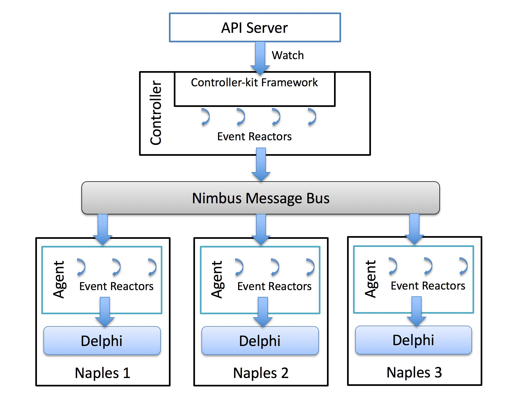

# Controller Kit Framework

Controller kit is a framework for writing Venice controllers. It is an event driven framework that eliminates lot of the boilerplate code required for watching objects from API server and distributing them to agents. Like most frameworks, it follows the inversion-of-control pattern where developers just have to implement the event callbacks(called reactors) and the framework manages the event loops, threading, locking of objects and other logistics.

## Architecture

In Venice, API server holds the desired state as expressed by the user. Job of the controllers is to make sure system reaches the desired state by programming the agents. In this sense, controllers are basically a big reconciliation loop that (a) monitors changes in desired state and programs the agents to reach the desired state and (b) monitors the change in operational state in agents and keep trying to make sure the system reaches the desired state.

This is achieved in three steps:
1. Controllers look at the desired state in API server and publish objects into a message bus(called "Nimbus" for easy pronunciation) 
2. Agents susbscribe to objects in Nimbus message bus and publish objects into Delphi database in Naples.
3. Lower level forwarding, platform components program the HW based on objects in Delphi database.

One way to think of these is, controllers operate at management plane, agents at control plane and HAL, Nicmgr are at the dataplane. For scalability reasons, all three steps are done as asynchronous even thandlers without any blocking calls. When a status needs to be propagated back up the chain, events are propagated up in exactly the reverse order.

Picture above shows the overall architecture of controllers, agents and how controler kit fits into bigger picture. Controller kit works by setting up watches on API server for the objects a controller is interested in. Developers of controllers typically have to implement `OnCreate`, `OnUpdate` and `OnDelete` event handlers for eahc kind of object they are interested in. For example, if a controller is interested in handling `Policy` object, it needs to implement `OnPolicyCreate`, `OnPolicyUpdate` and `OnPolicyDelete` callback. Controller kit framework will call these call backs whenever `Policy` object changes in API server.

Main job of these reactors is to program the agents by publishing objects into Nimbus message bus. Nimbus acts as a message bus plus database. Once the object is published into the message bus, agents will always see it even if they disconnect and connect back or restart. This lets the developers focus on the main logic without having to worry about distribution and transport of objects. Eventhough Nimbus provides a message bus like abstraction, underneath its just memdb database and GRPC streaming RPC calls.

When operation state changes in agents, they can publish them back to Nimbus message bus and they are propagated back up to the controllers. Controller kit provides another set of event callbacks for status update coming back from agents. Controllers can optionally implement `OnAgentStatus` reactors to handle these events. Again, underlying framework takes care of propagating these objects back and forth, managing their lifecycle and handling process restarts etc.

## Concurrency model

1. Controller kit uses goroutine-per-reactor model and automatically locks the event's primary object. In the reactor, if we need to access other objects, its developer's responsibility to lock them.
2. Currently controller kit updates only Meta and Spec part of the object from APIServer watch. Status part is owned by the controller and its the developer's responsibility to update it. When status updates arrive from agents, a reactor is called for each update. This reactor is called in Nimbus object's context(not APIServer object context). Its developer's responsibility to update the APIServer object(with the protection of a lock) and periodically write it back to APIServer. I need some input here if we can make it better.
3. As mentioned above, reactors on APIServer object and reactors on Nimbus objects do execute concurrently. Care must be taken when one is updating the other.
4. Currently, if a reactor fails. There is no retry mechanism. This leaves a hole in our "eventually reaching desired state" story. We'll need to add a retry mechanism and have a way to serialize events on an object so that deletes don't go ahead of adds and vice-versa.