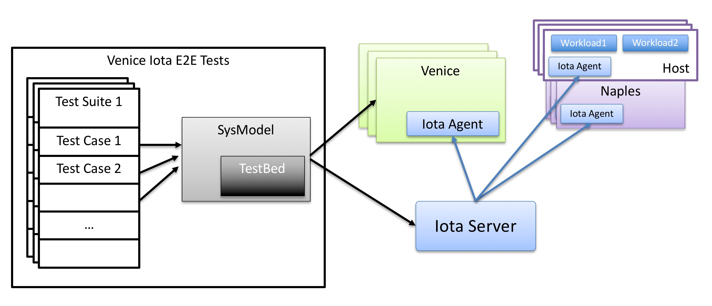

# Venice IOTA E2E Tests

Venice E2E tests are run using IOTA infrastructure on testbeds scheduled by CI infrastructure ( i.e. Jobd/Warmd). Typically this involves three or more Venice VMs and few Naples nodes. Naples can be real Naples HW(i.e. Baremetal) or Naples Sim running in a VM. IOTA infrastrucutre abstracts away most of the differences between various kinds of testbeds. Most of Venice tests should be written in testbed independent manner.

All Venice Iota E2E tests are written in Golang using [Ginkgo](http://onsi.github.io/ginkgo/) framework.

## Basic structure



Venice Iota E2E tests are written using iotakit library. This library provides an abstract model of the system under test. Tests can configure venice or perform actions on the cluster by manipulating this abstract model called "SysModel". Test cases are meant to be handfull of operations on sysmodel and most of the details of configuring Venice, triggering actions on Naples or workload is handled by Iota or Sysmodel.

Pensando CI infrastructre(Jobd/Warmd) schedules Venice VMs and Naples nodes from a pool of testbeds. CI infrastructure runs the Venice E2E tests in a Rund container. Warmd provides the topology of the testbed to Rund container in a file called `warmd.json`. Iotakit library uses this file and the test suite's topology file to build a model of the testbed. 

Iotakit library passes this information to Iota infrastructure along with the pointers to Venice and Naples images. Iota infra takes care of copying the image to the nodes in testbed, installing the images and bringing up the entire cluster in a clean and predictable manner. Iota infra consists of Iota server that runs in the Rund container and Iota agents that run on each tesbed node. Iota can perform triggers on these test nodes by running any command on it. Iota also takes care of running workloads on hosts, plumbing the vswitches to send the traffic to Naples etc. Iota can perform datapath traffic tests between workloads by running ping, netcat, iperf and other tools.

## Test suite organization

Venice tests are organized into test suites and each test suite has many test cases. See [Ginkgo](http://onsi.github.io/ginkgo/) framework documentation on how to write test cases. 

Each test suite inits the testbed by wiping out all old configs and starting everything fresh. This makes sure failure in one test suite does not affect other test suite. Note that test cases within a test suite run sequentially. Since all test cases share the same Venice cluster, its important to make sure that each test case leave the system back in its original state. 

After initializing the testbed, we create the `SysModel` that represents the entire test system including venice, naples, workloads and any third party tools we might use(like DHCP servers, LDAP servers etc). Typically we would init the sysmodel with a default config that creates certain basic objects like hosts, workloads, default policies etc that are required by most of the tests. But, certain tests like cluster tests, auth tests may not want to have this default configuration. In those cases, test suite can skip this step.

Today we have four test suites:
1. cluster: All venice only test cases go into this suite. This includes venice cluster tests, auth, api, search and other tests that dont require a naples.
2. smartnic: All smartnic related tests go into this suite. Nic admission, heartbeat and upgrade tests are in this suite
3. firewall: All firewall and networking feature related tests are in this suite. 
4. monitor: All monitoriing features like events, metrics, logging, techsupport related tests go in this suite.

Developers are encouraged to add more test suites as required. Since each test suite can potentially run parallely in different testbeds, more test suites will run faster.

## Writing test cases

Venice Iota test cases are meant to be written in high level api provided by SysModel. Most of the logic of changing configuration, verifying status and performing triggers is done by the SysModel. SysModel allows us to write test cases using high level primitives instead of object CRUD primitives. SysModel also has a very expressive query language to iterate over the model and perform operations on them.  

One way to think about this is: think of SysModel as an engine that can perform any operation. Your test case should be like a JSON that tells the engine what it needs to do. Instead of using JSON to describe the test steps, we use Golang, which is lot more expressive. But, try to keep the test cases themselves simple with as few lines of code as possible. A good yard stick for this is, if a test case is becoming more than handful of lines, its time to think about moving some logic to the SysModel so that test case becomes simpler. One advantage of having most of the logic in SysModel is, it enables high level of code reuse. If your test cases needs to perform some sequence of operations, make it generic and make it part of SysModel. Chances are someone else will also need similar operations in their test case.

Here is an example test:

```
var _ = Describe("workload tests", func() {
	Context("Basic workload tests", func() {
		It("Should be able to bringup new workloads and ping between them", func() {

			// bring up one new workload on each host in one of the Vlans
			workloads := ts.model.Hosts().NewWorkload("wtest", ts.model.Subnets().Any())
			Expect(workloads.Error()).ShouldNot(HaveOccurred())

			// check ping between each workloads
			Eventually(func() error {
				return ts.model.Action().PingPairs(workloads.MeshPairs())
			}).ShouldNot(HaveOccurred())

			// delete workloads
			Expect(workloads.Delete()).Should(Succeed())
		})
	})
})
```

This test case has three simple steps.

1. First it gets a collection of hosts and creates a new workload on each of the hosts
2. Next, it runs a ping test on full mesh of these workloads
3. Finally, it tears down the workloads and verifies its removed successfully

SysModel has three main concepts (i) Collections (ii) Filters and (iii) Actions. It allows very flexible ways to chain different collections, filters and actions to perform more complex operations. In the example above, the first step gets a collection of hosts and creates new workloads on them, which returns a collection of workloads. Later in second step, it uses workload collection to create full-mesh of workload pairs collection and runs PingPair action on each pair in the collection. Finally in third step, it deletes all workloads in the collection. This demonstrates how to chain collections and actions to perform very complex tests.

SysModel currently supports many operations. When you write your test case, its highly likely you would need to add more operations into SysModel. Feel free to add them into iotakit library. More primitives we have in the library, better it is for everyone.

## API Documentation

[Iotakit](./iotakit/iotakit.md)

## Running tests

Running IOTA E2E tests requires us to build both Venice image and Naples image. Its best to build the naples image on one of the build servers or on dev VMs. If you dont have a dev VM, you can use `srv6` or any of the other build servers. You can create a workspace on `/local/<pensando-user-id>/` folder on these servers.

### Step 1: Checkout pensando/sw workspace and all submodules

This step assumes you have passwordless SSH setup with github. If you are using https for github, change these steps accordingly.

```
cd $GOPATH/src/github.com/pensando
git clone ssh://github.com/pensando/sw.git
cd sw
git submodule init
git submodule update --recursive
```

### Step 2: Run the iota tests

```
USER="" rund-run --logdir ~/ --load-factor=4 iota/test/venice warmd
```

This will create a rund container on your dev machine, Build Venice and Naples images, create a 6-VM testbed(3 Venice nodes and 3 Naples sim nodes), run the tests on this testbed. Once the tests are done, it tears down the testbed and deletes the rund container.

** Run tests on Naples HW setup**

```
USER="" rund-run --logdir ~/ --load-factor=4 iota/test/venice/hwtest e2e-venice-2naples
```

This will reserve a testbed with two Naples HW and run the tests on it


### Keeping an IOTA testbed up and running for development and debugging

Instead of step 2 above, you can run this command to have a warmd testbed up and running during development.

**For Naples Sim setup:**

```
USER="" rund-run --logdir ~/ --load-factor=4 iota/test/venice/iotadev warmd
```

**For Naples HW setup:**

```
USER="" ~/go/bin/rund-run --logdir ~/ --load-factor=4 iota/test/venice/hwtest/hwtestdev e2e-venice-naples
```

This command brings up a rund container, builds Venice and Naples images, brings up a warmd testbed, runs IOTA server in rund container and just wait for you to run the test manually.

you can login to the rund container using:

```
docker exec -it <pensando-user-id>_rund bash
```

once you are in the rund container, you can rebuild venice or naples images and run the IOTA venice tests in `iota/test/venice/testsuites/` directory using standard `go test` command. Both `iota/test/venice/iotadev` and `iota/test/venice/hwtest/hwtestdev` have a convinient `make test` target to run all tests on NaplesSim setup of NaplesHW setup.

If you want to login to the testbed, rund container contains the test topology file called `/warmd.json`. you can do `
`cat /warmd.json | python -mjson.tool` to look at the contents of it. The "NodeMgmtIP" field in each node contains the ip address of the VM. 

**Some Useful env variables**

1. `SKIP_INSTALL=1` : this option will skip installing naples images. This is useful for re-running tests on a setup that already has correct images
2. `SKIP_SETUP=1` : this option is useful for rerunning tests on an already working setup. This will not cleanup configuration from previous run and just rerun the tests.
3. `STOP_ON_ERROR=1` : this option will stop the tests on first failure.

## Mocking test environment during development

Iota tests take relatively longer time to build the image, setup the testbed etc. While developing tests, we often need to quickly run the tests and debug them. iotakit has a builtin way to mock the testbed using `palazzo` venice simulator.  To mock the testbed you can run the tests with `MOCK_IOTA` environment flag.

```
JOB_ID=1 MOCK_IOTA=1 go test ./iota/test/venice/testsuites/firewall/ -testbed ./iota/test/venice/example/warmd.json -p 1 -v -ginkgo.v
```

This command will bringup a palazzo simulator on localhost. It'll create a mock testbed, mock iota server and make the SysModel think palazzo is the Venice cluster. This allows us to quickly check the behaviour of the test cases. One thing to remember is, since there is no real venice cluster, most of the actions like traffic tests, kubectl command etc dont work. This is meant to test the Venice API only. 

Note that iota e2e tests are meant to be run in jobd environments. So, they need JOB_ID environement varibale to be set, else they simply skip the tests. Also remember to build the palazzo binary before running the tests using `make palazzo` command.
