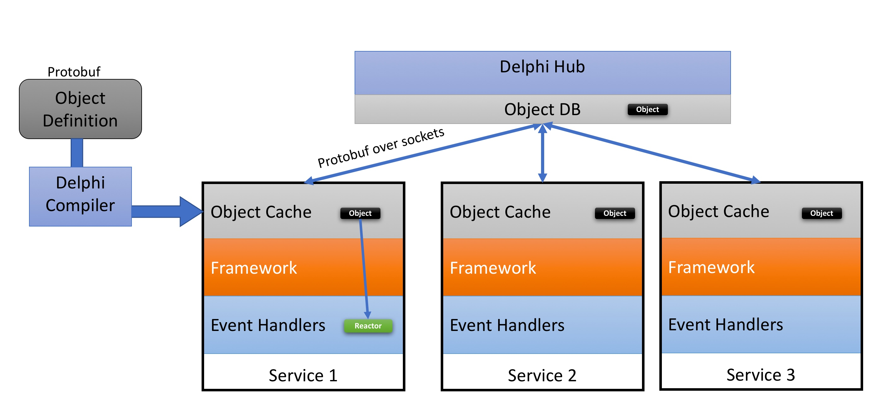

# Delphi Framework

Delphi is a reactive framework for writing Naples services(like Agents, HAL, NicMgr, LinkMgr etc). Delphi supports wiriting code in multiple languages like C++, Go and Python.



Delphi is made up of three components:

- Delphi Hub: is the central database that stores all state in the system.
- Delphi Compiler: compiles protobuf object model into delphi objects.
- Delphi Framework: runs the main event loop of each process and makes event callbacks to event reactors.


See [Overview](./docs/Overview.md) for more details on Delphi Framework.

See [here](./docs/Build.md) for instructions on how to build delphi and the examples.

See [here](./shm/Readme.md) for an overview of delphi shared memory implementation.

See [here](./tools/delphictl/Readme.md) for `delphictl` tool reference.

# Delphi Developer Guide

Delphi is a reactive framework. That means almost all code in delphi is written as event reactors on objects. Idea is to make the developers more productive by allowing them to focus on the core logic and eliminate the boilerplate as much as possible.

Writing a Delphi service is three step process:

1. Define the object model using protobuf
2. Create event reactors for the object
3. Create a service that mounts the objects and instantiates event reactors

<br>
Lets go over each step in detail.
<br> <br>

### 1. Define the object model

```
syntax = "proto3";
package example;

import "nic/delphi/proto/delphi/delphi.proto";

// Interface id
message IntfIndex {
    uint32    Ifidx = 1;
}

// Interface
enum IntfState {
    InvalidIntfState   = 0;
    IntfStateUp        = 1;
    IntfStateDown      = 2;
}

// spec part of the object
message InterfaceSpec {
    option (delphi.update_event) = true;
    delphi.ObjectMeta      Meta         = 1;
    IntfIndex              Key          = 2;
    IntfState              AdminState   = 3 [(delphi.event) = true];
    string                 MacAddress   = 4;
}

// status part of the object
message InterfaceStatus {
    option (delphi.update_event) = false;
    delphi.ObjectMeta      Meta              = 1;
    uint32                 Key               = 2;
    IntfState              OperState         = 3 [(delphi.event) = true];
    string                 DummyStatusField  = 4 [(delphi.event) = false];
}
```

The example above defines two objects `InterfaceSpec` and `InterfaceStatus`. Couple of things to note about the proto file.
1. Notice that all proto files need to import `nic/delphi/proto/delphi/delphi.proto`. This imports all delphi extensions to protobuf.
2. All Delphi objects are required to have an `delphi.ObjectMeta` field. This contains all the metadata about the object that framework needs. one important attribute of the metadata is object kind.  All delphi object classes needs to have a unique object kind.
3. All Delphi objects are required to have a field named `Key`. This field needs to contain the unique key for the object. This could be a scalar field like `uint32`, `uint64` or a `string`. Or this could be another structure, like in the example of `InterfaceSpec` which uses `IntfIndex` as the key.

In delphi, there can be event reactors for object create or delete event, or event reactor for individual field changes. For every object, delphi framework triggers `OnCreate()` and `OnDelete()` events. For each attribute that developer is interested in receiving update event, he should add an option `(delphi.event) = true` to the attribute. See `AdminState` attribute of `InterfaceSpec` object for an example.  Event reactors can be registered on a scalar value types or on nested structs. Notice that not all attributes of an object are required to generate events. Some attributes like 'description' is not required to generate any event.

In certain cases, its more beneficial to have an object level "update" event instead of an individual fields. In those cases `option (delphi.update_event) = true;` option can be specified on the object. In this case framework will trigger the update event on the object itself in addition to attribute level events.

Once the object model is defined, it can be compiled using delphi compiler `delphic` (pronounced 'delphi-c'). Delphi compiler generates the delphi object code in C++, Go and python. This generated code has all the hooks required by delphi framework for triggering events.

### 2. Define a reactor

```
#include "nic/delphi/sdk/delphi_sdk.hpp"
#include "nic/delphi/example/example.delphi.hpp"

// InterfaceMgr is the reactor for the InterfaceSpec object
class InterfaceMgr : public delphi::objects::InterfaceSpecReactor {
    delphi::SdkPtr sdk_;
public:
    InterfaceMgr(delphi::SdkPtr sk) {
        this->sdk_ = sk;
    }

    // OnInterfaceSpecCreate gets called when InterfaceSpec object is created
    virtual delphi::error OnInterfaceSpecCreate(delphi::objects::InterfaceSpecPtr intf) {
        LogInfo("InterfaceSpec got created for {}/{}", intf, intf->meta().ShortDebugString());

        // find the corresponding status object
        auto intfStatus = this->findIntfStatus(intf->key().ifidx());
        if (intfStatus == NULL) {
            // create the status object since it doesnt exist
            RETURN_IF_FAILED(this->createIntfStatus(intf->key().ifidx(), intf->adminstate()));
        }

        return delphi::error::OK();
    }

    // OnInterfaceSpecDelete gets called when InterfaceSpec object is deleted
    virtual delphi::error OnInterfaceSpecDelete(delphi::objects::InterfaceSpecPtr intf) {
        LogInfo("InterfaceSpec got deleted");
        return delphi::error::OK();
    }

    // OnAdminState gets called when AdminState attribute changes
    virtual delphi::error OnAdminState(delphi::objects::InterfaceSpecPtr intf) {
        // up or down?
        if (intf->adminstate() == example::IntfStateUp) {
            LogInfo("Interface is up");
        } else {
            LogInfo("Interface is down");
        }

        // set the oper state on status object
        auto intfStatus = this->findIntfStatus(intf->key().ifidx());
        if (intfStatus != NULL) {
            intfStatus->set_operstate(intf->adminstate());
            sdk_->SetObject(intfStatus);
        }

        return delphi::error::OK();
    }
};
typedef std::shared_ptr<InterfaceMgr> InterfaceMgrPtr;
```

Example above defines a reactor for `InterfaceSpec` object. Couple of things to notice about the reactors.

1. All delphi source or header files should `#include` `nic/delphi/sdk/delphi_sdk.hpp` file. This contains all the objects and functions required by the delphi framework.
2. Note that the file includes `nic/delphi/example/example.delphi.hpp` This is a file generated by the delphi compiler. This contains the c++ protobuf object definition for the `InterfaceSpec` object and the delphi extensions to it.
3. The reactor object `InterfaceMgr` inherits from `delphi::objects::InterfaceSpecReactor`. This is an object thats generated by the delphi compiler. For each delphi object, compiler generates a `xxxReactor` object. This object contains all the event handlers for the object as virtual functions. The derived object written by the developer can selectively override the events he is interested in handling.
4. All event reactors get a pointer to the object that changed. For example `OnInterfaceSpecCreate` event handler gets a pointer to `delphi::objects::InterfaceSpecPtr`. Delphi object for `InterfaceSpec` gets defined in `delphi::objects` namespace. `InterfaceSpecPtr` is a smart pointer to the object. In delphi, all objects are managed using smart pointers. Memory for these objects get freed when there is no one refering to the object.

### 3. Define a Service

```
// ExampleService is the service object for this example
class ExampleService : public delphi::Service, public enable_shared_from_this<ExampleService> {
private:
    InterfaceMgrPtr    intfMgr_;
    delphi::SdkPtr     sdk_;
public:
    // ExampleService constructor
    ExampleService(delphi::SdkPtr sk) {
        // save a pointer to sdk
        this->sdk_ = sk;

        // mount objects
        delphi::objects::InterfaceSpec::Mount(sdk_, delphi::ReadWriteMode);

        // create interface event handler
        intfMgr_ = make_shared<InterfaceMgr>(sdk_);

        // Register interface reactor
        delphi::objects::InterfaceSpec::Watch(sdk_, intfMgr_);
    }

    // OnMountComplete gets called when all the objects are mounted
    void OnMountComplete() {
        LogInfo("ExampleService OnMountComplete got called\n");

        // walk all interface objects and reconcile them
        vector<delphi::objects::InterfaceSpecPtr> iflist = delphi::objects::InterfaceSpec::List(sdk_);
        for (vector<delphi::objects::InterfaceSpecPtr>::iterator intf=iflist.begin(); intf!=iflist.end(); ++intf) {
            intfMgr_->OnInterfaceSpecCreate(*intf);
        }
    }
};
typedef std::shared_ptr<ExampleService> ExampleServicePtr;
```

This example shows a typical service.
1. All services should inherit from `delphi::Service` class.
2. Service constructor should take a pointer to `delphi::Sdk` object and store it for later use. All access to delphi objects are done thru the sdk object.
3. Service should mount the subtree of objects its interested in. In this example `delphi::objects::InterfaceSpec::Mount(sdk_, delphi::ReadWriteMode);` mounts the `InterfaceSpec` objects.
4. Service should instantiate the reactors for each object kind and establish watch for object kind.
5. Service needs to implement `OnMountComplete()` callback. This will get called after delphi framework has connected with delphi hub, mounted all the objects and they are available to the service in local memory. Service should reconcile all state during this callback. If service programs HW, it needs to make sure HW state is in sync with delphi object state. If service publishes any oper state, it needs to make sure its in sync with the config state in delphi DB.

### 4. Main loop

Finally, main loop of the service looks relatively simple:

```
int main(int argc, char **argv) {
    // Create delphi SDK instance
    delphi::SdkPtr sdk(make_shared<delphi::Sdk>());

    // Create a service instance
    shared_ptr<ExampleService> exsvc = make_shared<ExampleService>(sdk);
    assert(exsvc != NULL);
    sdk->RegisterService(exsvc);

    // run the main loop
    return sdk->MainLoop();
}
```

Main function does three things:
1. It instantiates the Delphi SDK. This in turn connects to the delphi hub.
2. It instantiates a service object and registers it with the delphi SDK.
3. It runs the main eventloop. Delphi event loop watches for changes from delphi hub and triggers event callbacks.

### 5. Create a module.mk build file for the service

For compiling a delphi service, you typically need to create three module.mk files.
1. a .mk file to compile .proto files and genereate C++/Python/Go files
2. a .mk file to compile generated C++ files to a library
3. a .mk file to build the service binary

Here is an example of module.mk file to compile the proto files
```
# {C} Copyright 2018 Pensando Systems Inc. All rights reserved
include ${MKDEFS}/pre.mk

MODULE_TARGET       = example.proto
MODULE_GEN_TYPES    = CC PY DELPHI
MODULE_INCS         = ${MODULE_DIR} \
                      ${TOPDIR}/nic \
                      ${TOPDIR}/nic/hal/third-party/google/include \
                      ${TOPDIR}/nic/delphi/proto/delphi \
                      /usr/local/include
MODULE_LDLIBS       = pthread
MODULE_POSTGEN_MK   = module_protolib.mk
MODULE_PREREQS = protoc-gen-delphi.gobin

include ${MKDEFS}/post.mk
```

Notice that `MODULE_TARGET` variable has a `.proto` extension. This tells the make infra that this make file will compile the proto files. `MODULE_GEN_TYPES` variables specifies the type of source files to generate. Finally, if you dont specify `MODULE_SRCS` variable, it will compile all `.proto` files in the folder.

Next, you need to write a .mk file to compile generated sources into a library

```
# {C} Copyright 2018 Pensando Systems Inc. All rights reserved
include ${MKDEFS}/pre.mk

MODULE_TARGET   = libdelphiexampleproto.a
MODULE_INCS     = /usr/local/include \
                  ${TOPDIR}/nic/hal/third-party/google/include \
                  ${TOPDIR}/hal/third-party/grpc/include
MODULE_FLAGS    = -O3
MODULE_EXCLUDE_FLAGS = -O2
MODULE_PREREQS  = example.proto
MODULE_SRCS     = ${BLD_PROTOGEN_DIR}/example.pb.cc ${BLD_PROTOGEN_DIR}/example.delphi.cc \
                  ${BLD_PROTOGEN_DIR}/example_stats.pb.cc ${BLD_PROTOGEN_DIR}/example_stats.delphi.cc

include ${MKDEFS}/post.mk
```

Finally, you need to write a module.mk file to compile the entire service binary

```
# {C} Copyright 2018 Pensando Systems Inc. All rights reserved
include ${MKDEFS}/pre.mk

MODULE_TARGET   = delphi_example.bin
MODULE_SOLIBS   = delphisdk
MODULE_LDLIBS   = ${NIC_THIRDPARTY_GOOGLE_LDLIBS} rt ev
MODULE_ARLIBS   = delphiexampleproto
ALL_CC_FILES    = $(wildcard ${MODULE_SRC_DIR}/*.cc)
ALL_TEST_FILES  = $(wildcard ${MODULE_SRC_DIR}/*_test.cc)
MODULE_SRCS     = $(filter-out $(ALL_TEST_FILES), $(ALL_CC_FILES))

include ${MKDEFS}/post.mk
```

## Writing unit tests

Delphi framework provides convenient wrappers for writing unit tests. Idea is to make it easy to write test code by emulating delphi database and events and objects. Delphi provides two ways to test your code:

1. Test single event reactor
2. Test an entire service

Here is an example of a simple test code that tests the `InterfaceSpec` reactor we wrote in previous section.

```
#include "gtest/gtest.h"
#include "example.hpp"
#include "nic/delphi/example/example.delphi_utest.hpp"

INTERFACESPEC_REACTOR_TEST(ExampleReactorTest, InterfaceMgr);

TEST_F(ExampleReactorTest, BasicTest) {
    // create an interface spec object
    delphi::objects::InterfaceSpecPtr intf = make_shared<delphi::objects::InterfaceSpec>();
    intf->mutable_key()->set_ifidx(1);
    intf->set_adminstate(example::IntfStateDown);
    sdk_->QueueUpdate(intf);

    // verify spec object is in db
    ASSERT_EQ_EVENTUALLY(sdk_->ListKind("InterfaceSpec").size(), 1) << "Interface spec object was not created";

    // verify corresponding status object was created by the reactor
    ASSERT_EQ_EVENTUALLY(sdk_->ListKind("InterfaceStatus").size(), 1) << "Interface status object was not created";
}
```

1. First you need to include the `example.delphi_utest.hpp` that was generated by the delphi compiler. This contains the wrappers required by the test code.
2. Next, you need to instantiate a mock service and run a mock event loop. This is achieved by calling the macro `INTERFACESPEC_REACTOR_TEST(ExampleReactorTest, InterfaceMgr);` This creates a dummy service that instantiates a reactor object of type `InterfaceMgr`. It mounts and watches all `InterfaceSPec` objects. It creates a gtest fixture called `ExampleReactorTest` and runs a delphi event loop in a seperate pthread.
3. After this, you can just start writing test code. In the above example `BasicTest` test case triggers a create event on an interface spec object and verifies that reactor has created the interface status object.
4. delphi SDK provides a `ASSERT_EQ_EVENTUALLY()` macro which is an asynchronous wrapper to `ASSERT_EQ()` macro with the same syntax. It periodically checks for the condition till it becomes true.

# Delphi Metrics Developer Guide

Delphi also provides a shared memory based metrics publishing mechanism. See [here](./shm/Readme.md) for an overview of underlying shared memory implementation. This section describes how to add new metrics kinds and publish stats.

Publishing metrics is three step process. First, you need to define a proto file describing the schema of the metrics object. Each metrics object can contain multiple attributes. Each attribute can be counter, gauge or histogram. This proto file is compiled it using `delphic` compiler. This will generate the C++/Golang/Python binding for publishing this kind of metrics. Second step is to instantiate a metric object in shared memory. Metrics objects are kept in shared memory in a hash table that can be scanned(i.e. iterated) or looked up using an object key. Third step is to periodically update the attributes. All attributes are kept in their raw form in shared memory(i.e, they are NOT serialized). Delphi compiler will generate the needed code to access these metrics attributes from different languages.

### 1. Define a proto file

```
syntax = "proto3";
package example;

import "nic/delphi/proto/delphi/delphi.proto";

message InterfaceMetrics {
    uint32                 Key          = 1;
    delphi.Counter         RxPkts       = 2;
    delphi.Counter         TxPkts       = 3;
    delphi.Gauge           RxPktRate    = 4;
    delphi.Gauge           TxPktRate    = 5;
    delphi.Counter         RxErrors     = 6;
    delphi.Counter         TxErrors     = 7;
}
```

proto file syntax looks very similar to delphi proto files. Any message with `Metrics` suffix is treated as a metrics object by delphi compiler. Message name becomes the metrics kind. Each metrics object needs to have a field named `Key`. This field uniquely identifies the metrics object instance. This also becomes the key to find the object in shared memory hash table. Key field can be a scalar field or a nested message. All other attributes in the metrics object are stats counters. They can be of type `delphi.Counter` which is a 64bit incrementing counter or it can be `delphi.Gauge` which is a 64bit floating point gauge who's value can go up or down over time. Histogram and summary types will also be supported soon.

### 2. Instantiate a metrics object

```
    if_stats = delphi::objects::InterfaceMetrics::NewInterfaceMetrics(10001);
    assert(if_stats != NULL);
```

This will instantiate new `InterfaceMetrics` object in shared memory with key `10001`.

### 3. Periodically set or increment stats

```
    // set or increments stats
    if_stats->RxPkts()->Incr();
    if_stats->TxPkts()->Incr();
    if_stats->RxPktRate()->Set(rand() % 5000);
    if_stats->TxPktRate()->Set(rand() % 8000);
    if_stats->RxErrors()->Add(rand() % 3);
    if_stats->TxErrors()->Add(rand() % 5);
```

Example above shows how to periodically set or increment stats attributes. Note that stats attributes can be accessed using their name as specified in the proto file.

#### Atomically publishing stats

In some cases, we might want to publish an entire metric atomically, instead of updating individual variables. In those case, we can use `Publish()` API instead of setting individual attributes.

Here is an example:

```
    interface_metrics_t if_metrics = {
        RxPkts: 10,
        TxPkts: 10,
        RxPktRate: 10.0,
        TxPktRate: 10.0,
    };

    // atomically publish a metric object
    if_stats->Publish(&if_metrics);
```

#### Datapath stats from PAL memory

Delphi metrics also provides a way to read datapath stats from PAL memory directly. In this case publisher(for example, nicmgr) will simply create a metric entry and point it to PAL physical memory address. When agents read this stats, they will simply read the datapath stats directly from PAL memory. For datapath stats, proto file object needs to have `delphi.datapath_metrics` option added to the message.

Here is an example proto file:

```
message InterfaceMetrics {
    option (delphi.datapath_metrics) = true;
    ExampleKey             Key          = 1;
    delphi.Counter         RxPkts       = 2;
    delphi.Counter         TxPkts       = 3;
    delphi.Gauge           RxPktRate    = 4;
}
```

then you can create metrics instance similar to before,

```
    // create a new datapath metric
    int32_t key = 100;
    InterfaceMetricPtr tmptr = InterfaceMetrics::NewInterfaceMetrics(key, pal_addr);
```

## Coding Style Guide

Delphi follows google c++ style guide https://google.github.io/styleguide/cppguide.html as much as possible. Please follow the same convention.
